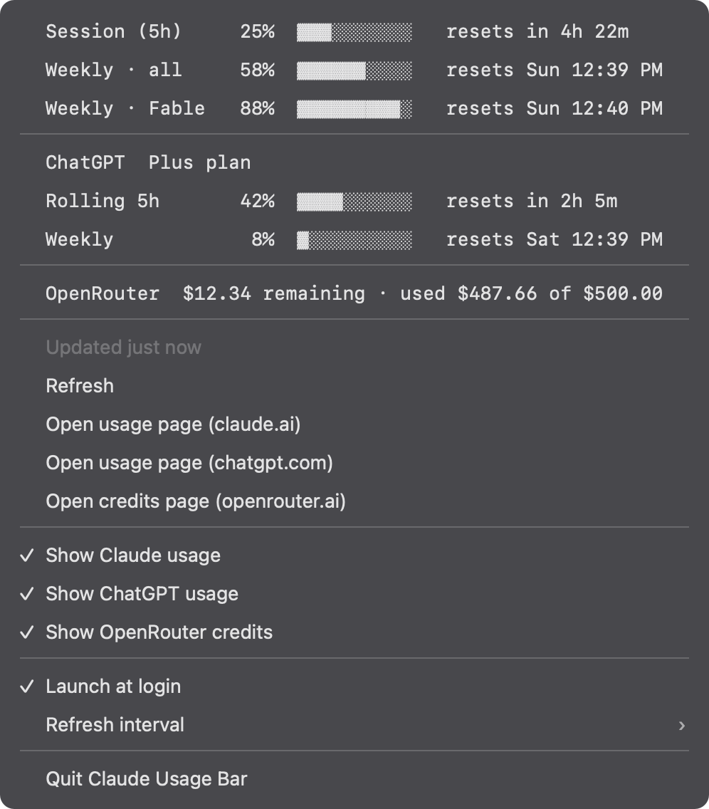

# Claude Usage Bar

A tiny macOS menu bar app that always shows your Claude subscription usage — plus,
if you use them, your ChatGPT usage and your remaining OpenRouter credits:

```
5h 25% · W 26% · F 17%   5h 42% · W 8%   $12.34
```

Each group sits behind its provider's logo — Anthropic's mark in front of the
Claude numbers, OpenAI's in front of the ChatGPT numbers, OpenRouter's in front of
the balance (see the screenshot below).

- **5h** — the rolling 5-hour session limit
- **W** — the weekly limit across all models
- **F** (or another letter) — a weekly limit scoped to one model, e.g. Fable
- **5h**, **W**, **M** behind the OpenAI mark — ChatGPT's own usage windows. The label
  is how long the window lasts, so it follows whatever your plan reports: a paid plan
  shows a rolling 5-hour window and a weekly one, a free account shows a single
  30-day window (`M`).
- **$…** — your OpenRouter credit balance (only shown when a key is found)

Percentages turn amber at 50 % and red at 80 %; the OpenRouter balance turns
amber below $5 and red below $1. Hover for reset countdowns. Click for bars,
exact reset times, a refresh button, links to each usage page, and settings.
Any provider can be hidden from the click menu; a hidden provider drops out
of the menu bar and is not polled at all until you show it again.

It shows the same numbers as the claude.ai usage page, the Claude Code status line,
and `codex`'s own status display, without keeping a browser tab open or clicking
anything.

## Screenshots

The menu bar item — one segment per limit, colored by how close you are:


Click it for bars, exact reset times, and settings:



*(Rendered from the app's own fonts, colors, and output.)*

## Requirements

- macOS 14 or newer
- [Claude Code](https://claude.com/claude-code) installed and signed in (`claude` → log in). The app reuses that login.
- Optional: [Codex](https://developers.openai.com/codex/) signed in with your ChatGPT
  account, or the ChatGPT desktop app, which keeps the same login. Without one the
  ChatGPT group simply does not appear.
- Optional: an OpenRouter API key exported as `OPENROUTER_API_KEY` in your shell
  config. Without one the OpenRouter group simply does not appear.
- To build from source: Xcode Command Line Tools (`xcode-select --install`)

## Install from source

```bash
git clone https://github.com/edward-sia/llm-usage-tracker.git
cd llm-usage-tracker
make install
```

`make install` builds a release binary, wraps it in `ClaudeUsageBar.app`, ad-hoc
signs it, copies it to `/Applications`, and launches it. Turn on **Launch at
login** from the click menu if you want it always there.

### Install with Claude Code (or any AI coding agent)

If you use an AI coding agent, point it at this repo and ask it to install the
app — the full recipe, with verification steps, is in
[`AGENTS.md`](AGENTS.md). A prompt like this is enough:

> Clone https://github.com/edward-sia/llm-usage-tracker, read AGENTS.md, and
> follow it to build and install Claude Usage Bar on my Mac.

Other targets: `make test` (unit tests), `make run` (build and launch from
`build/`), `make clean`.

If you download a pre-built zip instead of building, macOS will quarantine it.
This build is ad-hoc signed, not notarized, so Gatekeeper flags any copy that
arrived via a browser or other quarantine-aware app; a copy you build yourself
with `make install` is never quarantined in the first place. Remove the flag
before launching a downloaded copy:

```bash
xattr -dr com.apple.quarantine /Applications/ClaudeUsageBar.app
```

## How it works

1. Reads the OAuth access token that Claude Code stores in the macOS Keychain
   (item `Claude Code-credentials`), the same way Claude Code's own status line
   integrations do. Falls back to `~/.claude/.credentials.json`.
2. Calls `GET https://api.anthropic.com/api/oauth/usage` every 90 seconds (or
   60 s / 3 min / 5 min from the menu), on wake from sleep, when you click
   Refresh, and once when you open the menu (only if the numbers are more than
   ~20 seconds old).
3. Renders the `limits` from the response in the menu bar.
4. For ChatGPT, reads the access token Codex stores in `~/.codex/auth.json` after a
   "Sign in with ChatGPT" login (`$CODEX_HOME` is honored if you set it) and calls
   `GET https://chatgpt.com/backend-api/wham/usage` — the endpoint `codex` itself
   reads for its status display. The response describes each limit by how long its
   window lasts, which is where the `5h` / `W` / `M` labels come from. A Codex signed
   in with an API key instead of a ChatGPT account has no subscription to report, so
   no segment appears.
5. For OpenRouter, reads `OPENROUTER_API_KEY` from your shell config files
   (`~/.zshrc`, `~/.zshenv`, `~/.zprofile`, `~/.bashrc`, `~/.bash_profile`,
   `~/.profile` — first file with a usable line wins) and calls
   `GET https://openrouter.ai/api/v1/credits` on the same schedule. The menu bar
   shows credits purchased minus credits used. No key found means no segment —
   nothing else changes.

Anthropic's usage endpoint is shared and rate-limited — it also backs the claude.ai
usage page and the Claude Code status line. If too many requests go out on your
account at once (this app, the Claude Code status line, and other tools all use
the same token), it returns HTTP 429. The response usually names a wait in its
`Retry-After` header; the app honors it (clamped between 5 minutes and 1 hour),
shows it in the menu (`Rate limited. Next refresh in 27 min (server's
Retry-After).`), keeps your last numbers, and does not poll again until the wait
is over. Wake from sleep is the moment every client on the machine refreshes at
once, so after wake the app deliberately waits a random 30–90 seconds before its
own fetch instead of joining that burst. It also never polls faster than 60 s
and skips the menu-open fetch while numbers are still fresh.

ChatGPT's usage endpoint is shared and rate limited the same way Anthropic's is — the
ChatGPT app and `codex` read it too. Its shortest window is five hours, so a percentage
cannot move much minute to minute, and this app never polls it faster than once every
3 minutes however low you set the refresh interval. It also reuses ChatGPT numbers for
2 minutes before an opportunistic refresh (opening the menu, waking from sleep) will
fetch again, where the other two providers reuse theirs for 20 seconds.

### Logs

Every fetch writes one line to the macOS unified log: what triggered it (timer,
menu open, wake, manual, start), the outcome, the server's `Retry-After` on a
429, and how long the request took. To see the last few hours:

```bash
log show --last 6h --predicate 'subsystem == "dev.llm-usage-tracker.ClaudeUsageBar"'
```

or to watch live:

```bash
log stream --predicate 'subsystem == "dev.llm-usage-tracker.ClaudeUsageBar"'
```

The `claude` category is the Claude usage poller, `chatgpt` the ChatGPT one, and
`openrouter` the credits poller. Nothing sensitive is logged — no tokens, no usage
numbers.

The app is read-only: it never writes to the Keychain or to `~/.codex/auth.json`, and
never refreshes a token itself (Claude Code and Codex do that). If a token expires, the
app shows a warning and picks up the new one on the next refresh after you use that
tool again.

## Privacy

Nothing leaves your Mac except three requests, each authenticated with a credential
that tool already stored on your Mac: Anthropic's usage endpoint with your Claude Code
token; ChatGPT's usage endpoint with the token Codex saved, and only when you have one;
and OpenRouter's credits endpoint with your OpenRouter key, and only when you have one.
There is no telemetry, no third-party server, and no storage beyond the
refresh-interval and per-provider visibility preferences.

## Troubleshooting

| Menu bar shows | Meaning | Fix |
|---|---|---|
| `⚠︎ not signed in` | No Claude Code credentials found | Run `claude` in a terminal and log in |
| numbers followed by `⚠︎` | Last refresh failed; numbers are stale | Hover or click for the reason (offline, token expired, rate limited, API error) |
| `…` | First fetch has not finished | Wait a second; hover shows "Loading Claude usage…" |
| no ChatGPT segment | No ChatGPT login found in `~/.codex/auth.json` (or the provider is toggled off in the click menu) | Run `codex` and choose Sign in with ChatGPT, or sign in to the ChatGPT desktop app |
| OpenAI logo + `⚠︎` | The ChatGPT usage fetch failed | Hover or click for the reason |
| no OpenRouter segment | No `OPENROUTER_API_KEY` found in shell config (or the provider is toggled off in the click menu) | Add `export OPENROUTER_API_KEY=…` to `~/.zshrc` (or another file the app reads — see How it works) |
| OpenRouter logo + `⚠︎` | The OpenRouter credits fetch failed | Hover or click for the reason |
| only a gauge glyph | Every provider is toggled off | Click it and turn a provider back on |

"Launch at login" only works when the app runs from `/Applications` (i.e. after
`make install`), because macOS registers login items by bundle.

## Development

```bash
swift test          # unit tests for everything except the AppKit glue
swift build         # debug build
make run            # build the .app and launch it
```

Structure: `Sources/ClaudeUsageBarCore` (models, credential reading, API client,
formatting, poller — all unit-tested, no AppKit) and `Sources/ClaudeUsageBar`
(the menu bar UI). Design notes live in `docs/superpowers/specs/`.

## Roadmap

- Floating always-on-top overlay as an alternative to the menu bar
- Notifications when a limit crosses a threshold
- Signed/notarized releases and a Homebrew cask

## License

MIT — see `LICENSE`.
